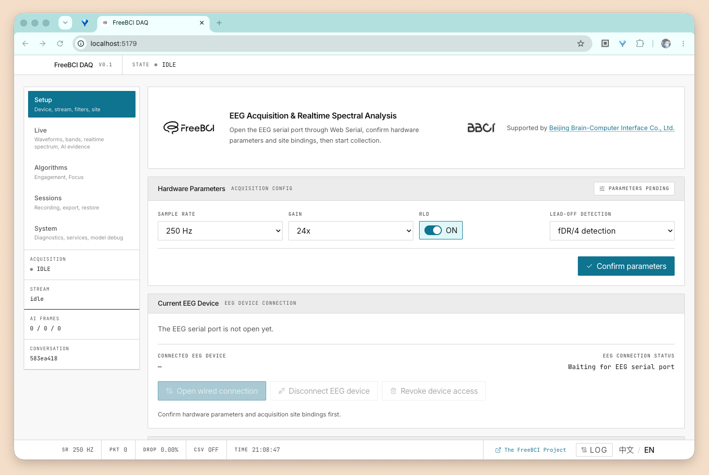

<p align="center">
  
</p>

<div align="center">

# FreeBCI DAQ

[](./LICENSE)
[]()
[]()

浏览器端 EEG 脑电信号采集与实时分析平台  
Browser-based EEG acquisition & real-time analysis

</div>

FreeBCI DAQ connects to EEG hardware via **Web Serial** and provides real-time waveforms, spectral analysis (FFT), engagement index (EI), binary focus classification, and AI-assisted interpretation — all running locally in your browser. No backend. No cloud. Your data stays on your machine.

本项目是 [The FreeBCI Project](https://github.com/freebci) 的一部分，由 [北京脑机接口商业有限公司](https://www.bbci.net) 支持。

## Quick Start

Requires **Chrome** or **Edge** with Web Serial support, served from `localhost`, `127.0.0.1`, or HTTPS.

```bash
npm install
npm run dev
```

Open `http://localhost:5173`, connect your EEG device, confirm hardware parameters and site bindings, then start collection.

## Features

| | |
|---|---|
| **EEG 采集** | Web Serial 直连硬件，`EEGRST` / `EEGCFG` / `SW,START` 协议，int24 二进制帧 |
| **实时波形** | 原始信号与滤波后信号双通道 Canvas 渲染 |
| **频域分析** | 2s 滑动窗口 FFT，输出 δ / θ / α / β / γ 五频带功率 |
| **专注度指数** | EI = β / (α + θ)，EMA 平滑，可配置告警阈值 |
| **专注状态判定** | Baseline 校准 + 滑动窗口二元分类（专注 / 不专注） |
| **AI 分析** | 自然语言提问，支持 OpenAI / DeepSeek / Ollama，无 API Key 时自动回退本地分析 |
| **CSV 导出** | 实时落盘，带 EEG channel/site 元数据头 |
| **中英双语** | zh-CN / en-US 一键切换，400+ 界面文案全覆盖 |

## Documentation

- **[ROADMAP.md](./ROADMAP.md)** — 版本规划：算法、WASM、蓝牙、桌面版
- **[ARCHITECTURE.md](./ARCHITECTURE.md)** — 架构设计、数据流、设计模式
- **[TUNING.md](./TUNING.md)** — 参数调参指南（EMA、告警阈值、专注判定窗口）
- **[I18N.md](./I18N.md)** — 中英文翻译对照表
- **[AGENTS.md](./AGENTS.md)** — 开发命令、架构边界、检查清单

## License

AGPL v3 with additional commercial terms. See [LICENSE](./LICENSE).

- Academic research, education, personal use — **free**
- Commercial use — **requires a separate license**
- Copyright 2026 北京脑机接口商业有限公司 / Beijing Brain-Computer Interface Co., Ltd.

Commercial licensing: [https://www.bbci.net](https://www.bbci.net)
